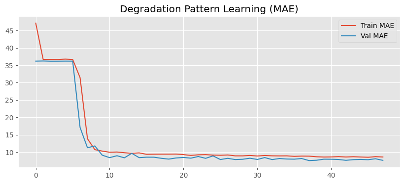
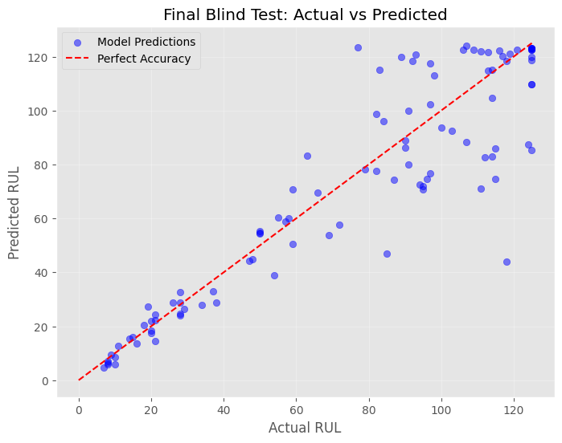

# ✈️ Jet Engine RUL Prediction


> Predicting how many flight cycles a jet engine has left before failure — using deep learning on NASA's CMAPSS simulation data.

---

## 🧠 Overview

This project builds an **LSTM-based deep learning model** to predict the **Remaining Useful Life (RUL)** of turbofan jet engines from multivariate sensor time-series data. It includes uncertainty estimation via Monte Carlo Dropout, explainable AI via feature correlation, and deployment-ready TFLite conversion.

**Real-world impact:** Enables airlines to schedule maintenance at exactly the right time — avoiding both catastrophic failure and unnecessary early grounding.

---

## 📊 Results

| Metric | Value |
|---|---|
| MAE (validation) | 7.61 cycles |
| RMSE | 11.41 cycles |
| R² Score | 0.923 |
| Binary Accuracy (RUL ≤ 30) | 97.67% |
| Precision | 0.9561 |
| Recall | 0.9233 |
| F1 Score | 0.9394 |
| AUC-ROC | ~0.97 |
| Inference Latency | ~0.04 ms/prediction |
| Blind Test MAE | 11.31 cycles |

---

## 📈 Visualizations

### Engine Degradation Tracking (with 95% Confidence Interval)


### Actual vs Predicted RUL



---

## 🏗️ Model Architecture

Input → (50 time steps × 17 features)
↓
LSTM(128, return_sequences=True) + Dropout(0.2)
↓
LSTM(64, return_sequences=False) + Dropout(0.2)
↓
Dense(32, ReLU)
↓
Dense(1, Linear) → Predicted RUL (cycles)

**Loss:** Huber | **Optimizer:** Adam (lr=0.001) | **Total params:** 126,785

## 📁 Dataset

**NASA CMAPSS** (Commercial Modular Aero-Propulsion System Simulation)

- 100 turbofan engines simulated to failure
- 26 columns: unit ID, cycle, 3 operational settings, 21 sensors
- Subset used: **FD001** (1 operating condition, HPC degradation fault)
- 20,631 training rows across 100 engine lifetimes

📥 Download: [NASA Prognostics Data Repository](https://www.nasa.gov/intelligent-systems-division/discovery-and-systems-health/pcoe/pcoe-data-set-repository/)

---

## 🚀 How to Run

1. Clone this repo
```bash
   git clone https://github.com/Tarang06go/Jet-Engine-RUL-Prediction.git
```
2. Download the CMAPSS dataset from the NASA link above
3. Upload dataset to Google Drive
4. Open `turbofan_rul_prediction.ipynb` in **Google Colab**
5. Update the file paths in Cell 2 to match your Drive location
6. Run all cells in order

---

## 🛠️ Tech Stack

- Python 3.10
- TensorFlow / Keras — LSTM model
- scikit-learn — preprocessing & metrics
- pandas / numpy — data handling
- Matplotlib / Seaborn — visualization
- TensorFlow Lite — edge deployment

---

## ✨ Key Features

- **Sliding window sequences** (50 cycles) for temporal pattern learning
- **RUL clipping at 125** for piecewise linear target stabilization
- **Monte Carlo Dropout** for uncertainty-aware predictions
- **Transfer learning** to FD004 (6 operating conditions)
- **TFLite conversion** for embedded/edge deployment
- **Explainable AI** via sensor correlation analysis

---

## 📄 License

MIT License — see [LICENSE](LICENSE) for details.
